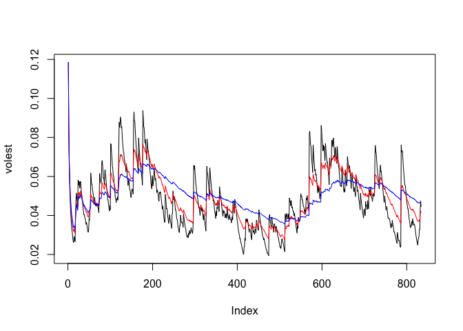

# Volatility
Peter Byrd  
November 13, 2016  

# AGIO Financial Data and Volatility

Includes data from 2013-07-24 thru 2016-11-11.

## Load data
First we must install packages and load the appropriate data from our data source.


```r
## Set the working directory and load packages
setwd("/Users/pbyrd/Git/Week11LectureAssignment")

## Install and load the following packages: 
# install.packages('tseries')
library(tseries)

## Read the file
AGIOdata <- get.hist.quote('agio',quote="Close")
```

```
## time series starts 2013-07-24
## time series ends   2016-11-11
```

```r
length(AGIOdata)
```

```
## [1] 835
```

## Create a new dataset of Returns and calculate Volatility


```r
## Calculate Returns and Volatility
AGIOret  <- log(lag(AGIOdata)) - log(AGIOdata)
AGIOvol  <- sd(AGIOret)*sqrt(250)*100
length(AGIOret)
```

```
## [1] 834
```

```r
AGIOvol
```

```
## [1] 79.80681
```

## Creat a volatility function with lookback window


```r
## Create volatility function
Vol <- function (d,logrets){
  var=0
  lam=0
  varlist <- c()
  for (r in logrets) {
    lam = lam*(1 - 1/d) + 1
    var = (1 - 1/lam)*var + (1/lam)*r^2
    varlist <- c(varlist,var)
  }
  sqrt(varlist)}
```

## Run three scenarios with d = 10, 30, and 100


```r
## Run three scenarios of d=10,30,100
volest <- Vol(10,AGIOret)
volest2 <- Vol(30,AGIOret)
volest3 <- Vol(100,AGIOret)
```

## Plot the results


```r
## Plot the volatility results
plot(volest,type="l")
lines(volest2,type="l",col="red")
lines(volest3,type="l",col="blue")
```

<!-- -->

## Conclusion

We see the smoothest result with d=100.
